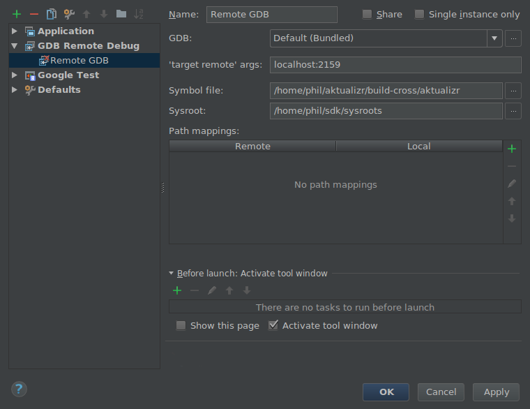

# aktualizr

> C++ reference implementation of [GENIVI SOTA](https://github.com/advancedtelematic/rvi_sota_server) OTA update client.

The client is intended to be installed on devices that wish to receive OTA updates from a GENIVI-compatible OTA server.

The client is responsible for:

 - Communicating with the OTA server
 - Authenticating using locally available device and user credentials
 - Reporting current software and hardware configuration to the server
 - Checking for any available updates for the device
 - Downloaded any available updates
 - Installing the updates on the system, or notifying other services of the availability of the downloaded file
 - Receiving or generating installation reports (success or failure) for attempts to install received software
 - Submitting installation reports to the server

The client maintains the integrity and confidentiality of the OTA update in transit, communicating with the server over a TLS link. The client can run either as a system service, periodically checking for updates, or can by triggered by other system interactions (for example on user request, or on receipt of a wake-up message from the OTA server).

## Table of Contents

- [Security](#security)
- [Install](#install)
  - [Dependencies](#dependencies)
  - [Building](#building)
  - [Linting](#linting)
  - [Testing](#testing)
  - [Code Coverage](#code-coverage)
  - [Building with Docker](#building-with-docker)
- [Usage](#usage)
- [Maintainers](#maintainers)
- [Contribute](#contribute)
- [License](#license)

## Security

This client, and the [GENIVI SOTA](https://github.com/advancedtelematic/rvi_sota_server) project, is aligned with the [Uptane](https://uptane.github.io) security framework for software updates. Full details and whitepapers can be found on their site.

## Install

### Dependencies

The following debian packages are used in the project:

 - libboost-dev
 - libboost-program-options-dev (>= 1.58.0)
 - libboost-system-dev (>= 1.58.0)
 - libboost-thread-dev (>= 1.58.0)
 - libboost-log-dev (>= 1.58.0)
 - libboost-regex-dev (>= 1.58.0)
 - libboost-random-dev (>= 1.58.0)
 - libpthread-stubs0-dev (>=0.3)
 - libyaml-cpp-dev (>=0.5.2)
 - curl (>= 7.47)
 - libcurl4-openssl-dev (>= 7.47)
 - cmake (>= 3.5.1)
 - libostree-dev
 - valgrind
 - libjansson-dev
 - libssl-dev
 - libarchive-dev
 - libsodium-dev
 - clang (optional)
 - clang-format-3.8 (optional)
 - python3-dev (when building tests)
 - python-virtualenv (when building tests)
 - libdbus-1-dev (when building tests)
 - lcov (when building for code coverage)

### Building

This project uses **git submodules**. To checkout the code:

~~~
git clone --recursive https://github.com/advancedtelematic/aktualizr
~~~

If you had an old checkout, forgot to include `--recursive` or need to update the submodules, run:

~~~
git submodule update --init --recursive
~~~

`aktualizr` is built using CMake. To setup your `build` directory:

~~~
mkdir build
cd build
cmake ..
~~~

You can then build the project from the `build` directory using Make:

~~~
make
~~~

### Linting

Before checking in code, the code linting checks should be run:

~~~
make qa
~~~

### Testing

To run the test suite:

~~~
make test
~~~

### Code Coverage

The project can be configured to generate a code coverage report. First, create a CMake build directory for coverage builds, and invoke CMake with the `-DBUILD_WITH_CODE_COVERAGE=ON` flag:

~~~
mkdir build-coverage
cd build-coverage
cmake -DBUILD_WITH_CODE_COVERAGE=ON ..
~~~

Then use Make from the `build-coverage` directory to run the coverage report:

~~~
make coverage
~~~

The report will be output to the `coverage` folder in your `build-coverage` directory.

### Building with Docker

A Dockerfile is provided to support building / testing the application without dependencies on your local environment. If you have a working docker client and docker server running on your machine, you can build a docker image with:

~~~
docker build -t advancedtelematic/aktualizr .
~~~

Once this docker image is built, Aktualizr can be built and tested with:

~~~
docker run --rm -it advancedtelematic/aktualizr src/scripts/coverage.sh
~~~

The following command will get a shell to perform an interactive build, but note that your local working copy will not be synchronised with the Docker container. The recommended development workflow is perform local cmake builds, but passing `-v $(pwd):/aktualizr-local` to `docker run` is an alternative.

~~~
docker run --rm -it advancedtelematic/aktualizr
~~~

### Developing against an OpenEmbedded system

By default OpenEmbedded builds fixed versions of software from a VCS using bitbake recipes. When developing Aktualizr itself it is useful to have a quicker edit-compile-run cycle and access to a debugger.  The following steps will use OpenEmbedded to create a cross-compilation environment, then build inside that.

1. Add the following to local.conf:
~~~
TOOLCHAIN_HOST_TASK_append = " nativesdk-cmake "
~~~

2. Build the SDK:
~~~
# bitbake -c populate_sdk core-image-minimal
~~~

3. That will create a self-extracting installer that can be copied to your development machine. Install it by executing this script (or a similarly-named one, depending on your environment):
~~~
# ./tmp/deploy/sdk/poky-sota-glibc-x86_64-core-image-minimal-core2-64-toolchain-2.2.2.sh
~~~

4. Execute this script (or something similar, depending on where you installed it) to update the environment to point to the cross compilers:
~~~
# . /opt/poky-sota/2.2.2/environment-setup-core2-64-poky-linux
# which cmake
/opt/poky-sota/2.2.2/sysroots/x86_64-pokysdk-linux/usr/bin/cmake
~~~

5. Create a cmake build directory for this cross-compile:
~~~
# mkdir build-cross
# cd bulid-cross
# cmake ..
# make aktualizr
~~~

The built 'aktualizr' executable can be copied to the remote system and run.

Aktualizr can be debugged remotely by exposing a port from the VM to development machine (the --gdb option to the run-qemu script in meta-updater-qemu-x86 does this), then:

~~~
On the target:
# gdbserver 0.0.0.0:2159 ./aktualizr --config /etc/sota.toml --loglevel 0

On the host:
# gdb aktualizr
(gdb) target remote localhost:2159
~~~

In CLion the remote debugger is configured as follows:

It is also possible to run it inside valgrind:

~~~
On the target
# valgrind --vgdb=yes --vgdb-error=0 ./aktualizr --config /etc/sota.toml
# vgdb --port=2159
...now connect the debugger as usual
~~~

## Usage

Run the client and provide a yaml formatted configuration file using the commandline option -c or --config. The configuration file has to contain the OAuth2 server URL, the SOTA server URL, a valid clientID and according secret and a valid device UUID. See the example config file at config/config.yml.example. The client will use the clientID and according secret to get an OAuth2 token from the authorization server which is then used to send API requests to the SOTA server.

~~~
aktualizr -c <path/configfile>
~~~

## Maintainers

This code is maintained by the team at [ATS Advanced Telematic Systems GmbH](https://www.advancedtelematic.com). If you have questions about the project, please reach us through Github issues for this repository.

## Contribute

Complete contibution guidelines can be found in [CONTRIBUTING.md](CONTRIBUTING.md)

## License

This code is licensed under the [Mozilla Public License 2.0](LICENSE), a copy of which can be found in this repository. All code is copyright [ATS Advanced Telematic Systems GmbH](https://www.advancedtelematic.com), 2016-2017.

